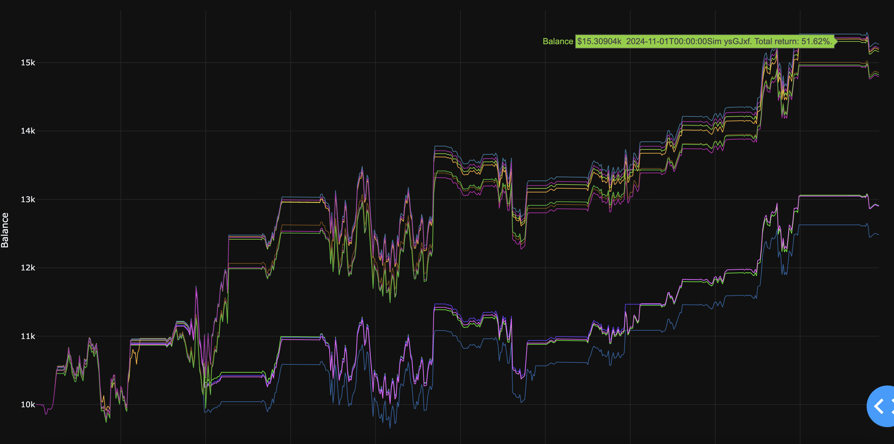
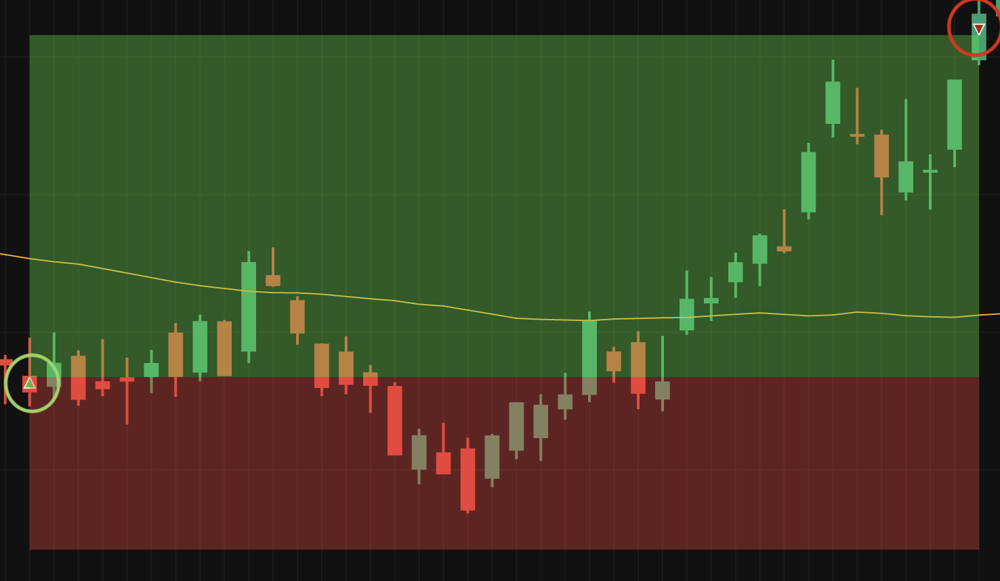

# Quantitative Trading Strategy Backtester

A Python-based backtesting framework for developing, optimizing, and evaluating systematic trading strategies on US equities. Features Monte Carlo parameter optimization, real-time visualization, and comprehensive performance analytics.

---

## Overview

This framework enables rapid strategy development and testing through:

- **Vectorized backtesting engine** for historical price data (yfinance API)
- **Monte Carlo parameter optimization** with percentile-based filtering
- **Dynamic risk management** via ATR-based stop-loss/take-profit
- **Real-time strategy visualization** using Plotly/Dash
- **Position sizing controls** with concurrent position limits and capital allocation rules

---

## Architecture

### Backtesting Engine

The backtesting system operates on OHLC candlestick data with calculated technical indicators:

**Data Pipeline:**

```
yfinance API → Data validation → Indicator calculation → Strategy execution → Performance metrics
```

**Available Indicators:**

- Simple Moving Average (SMA)
- Relative Strength Index (RSI)
- Average True Range (ATR)
- Rolling Standard Deviation

The engine processes each candle sequentially, evaluating entry/exit conditions while enforcing risk management rules and position limits. Account state (balance, shares owned, unrealized P&L) updates after each candle.


### Risk Management

**ATR-Based Exits:**

- Stop-loss: `entry_price - (ATR × stoploss_multiplier)`
- Take-profit: `entry_price + (ATR × takeprofit_multiplier)`

Positions automatically exit when price breaches either threshold. ATR multipliers are configurable and can be optimized via simulation.

**Position Controls:**

- Maximum concurrent positions
- Per-trade capital limits
- Minimum uninvested balance requirements

### Monte Carlo Optimization

The simulation framework performs parameter space exploration to identify optimal strategy configurations.

**Process:**

1. **Parameter Randomization** — Each simulation randomizes configured parameters within specified ranges:

   - Indicator periods (RSI, ATR, SMA, standard deviation)
   - Position sizing (max order value, buy multiplier)
   - Risk parameters (stop-loss/take-profit ATR multipliers)
   - Strategy-specific parameters

2. **Backtest Execution** — Each parameter set runs against historical data, generating:

   - Total return (%)
   - Final portfolio value
   - Win rate (%)
   - Number of trades executed

3. **Percentile Filtering** — Results are ranked by total return and final value. Only backtests exceeding the configured percentile threshold (default: 90th) are saved to `backtest_results/best_backtests.json`.

4. **Iterative Refinement** — Best-performing parameter sets can be re-simulated by enabling `simBestBacktests`, which:
   - Loads top configurations from `best_backtests.json`
   - Re-runs each on the same historical period
   - Overwrites results with the new top performers

This creates a genetic algorithm-like optimization where successive simulation rounds converge toward optimal parameters.



**Output Files:**

- `backtest_results/sim-{ID}.json` — Full results for each simulation run
- `backtest_results/best_backtests.json` — Cumulative top performers across all runs

---

## Included Strategy: Bearish Comeback

The default strategy implements a mean-reversion approach targeting oversold conditions:

**Entry Logic:**

```python
price_decline = (price_{t-period} - price_current) / std_dev
threshold = A - (B × ln(period + 1))

if price_decline > threshold and previous_candle_bearish:
    position_size = base_order_value × price_decline_ratio
    enter_long()
```

**Parameters:**

- `A`, `B`: Decline sensitivity coefficients
- `period`: Lookback window (default: 7 candles)

Strategy enters when recent price decline exceeds a logarithmically-scaled threshold, with position size proportional to decline magnitude. Exits via ATR-based stops or take-profit targets.



---

## Quickstart

**Prerequisites:** Python 3.7+

### Installation

```bash
git clone https://github.com/JamieWells1/trading-algorithm-boilerplate.git
cd trading-algorithm-boilerplate
python3 -m venv .venv
source .venv/bin/activate  # Windows: .venv\Scripts\activate
pip install -r requirements.txt
```

### Run Backtest

```bash
python main.py
```

Navigate to `http://127.0.0.1:8050` to view interactive charts.

### Run Simulation

Edit `config.json`:

```json
{
  "general": { "simulate": true },
  "simulate": { "simulations": 100 }
}
```

Then restart: `python main.py`

---

## Strategy Development

### Minimal Strategy Template

Edit `core/order.py` (lines 94-138):

```python
# Entry signal
if can_buy and your_condition:
    buy(entries, amount, price)
    stoploss_takeprofit.update(price, atr, datetime)

# Exit signal (optional — ATR stops handle this by default)
if your_exit_condition:
    sell(exits, price)
    stoploss_takeprofit.remove()
```

### Available Data Per Candle

```python
candle["datetime"]  # Timestamp
candle["open"]      # Open price
candle["close"]     # Close price
candle["high"]      # High price
candle["low"]       # Low price
candle["sma"]       # Simple moving average
candle["rsi"]       # RSI (0-100)
candle["atr"]       # Average true range
candle["std_dev"]   # Standard deviation
```

### Configuration Reference

**Key Settings (`config.json`):**

```json
{
  "general": {
    "ticker": "AAPL", // yfinance ticker
    "interval": "1d", // 1m, 5m, 15m, 1h, 1d etc
    "startDate": "2022-01-01",
    "endDate": "2025-01-01",
    "simulate": false // Enable Monte Carlo
  },
  "account": {
    "initialBalance": 10000,
    "baseOrderValue": 1000, // Minimum trade size
    "maxOrderValue": 8000, // Maximum trade size
    "maxConcurrentPositions": 5
  },
  "multipliers": {
    "buyMultiplier": 1.5, // Position sizing scalar
    "stoplossAtrMultiplier": 1.5,
    "takeprofitAtrMultiplier": 3.0
  },
  "simulate": {
    "simulations": 100,
    "simBestBacktests": false, // Re-simulate top performers
    "topResultsPercentile": 90 // Filter threshold
  }
}
```

---

## Performance Metrics

Each backtest calculates:

- **Total Return** — `(final_value - initial_value) / initial_value × 100`
- **Win Rate** — `profitable_trades / completed_trades × 100`
- **Final Portfolio Value** — Absolute ending capital
- **Trade Count** — Number of completed round trips

Results are printed to console and saved to JSON with full parameter configurations for reproducibility.

---

## Technical Notes

- **Asset Class:** US equities and ETFs (Yahoo Finance coverage)
- **Execution Model:** Assumes market orders filled at candle open/close
- **Slippage/Commissions:** Not modeled (can be added in `Account.buy_order()`)
- **Data Quality:** Relies on yfinance data integrity; includes repair functionality for stock splits

---

## Roadmap

- Live trading integration (Alpaca API)
- Walk-forward analysis
- Multi-asset portfolio backtesting
- Sharpe ratio, max drawdown, and additional risk metrics
- Web dashboard for strategy comparison

---

## Contributing

Pull requests welcome. For major changes, open an issue first to discuss proposed modifications.

**Contact:** [GitHub Issues](https://github.com/JamieWells1/trading-algorithm-boilerplate/issues)

MIT License
